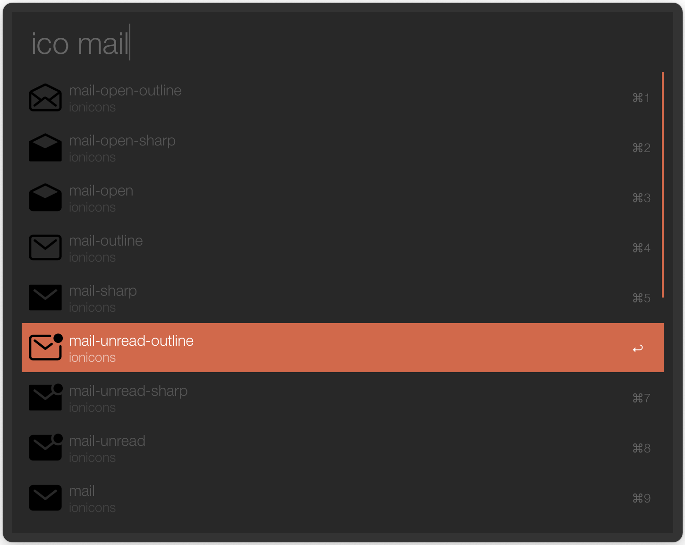

Icon Search Workflow for [Alfred 3](http://www.alfredapp.com)
==============================

Find any icon by name across several different icon libraries. Currently supports **Ionicons** and **Hericons**.

**[DOWNLOAD](/alfred-icon-search.alfredworkflow)**

Setup
-----

Download and run the alfred-icon-search.alfredworkflow file. The rest of this repo is just the source for anyone interested.

Key Combinations
----------------

Key Combination        | Action
---------------------- | ------
`shift`                | copy icon as svg to your clipboard
`enter`                | copy icon name

### Repo commands

* `ico <name of icon>`